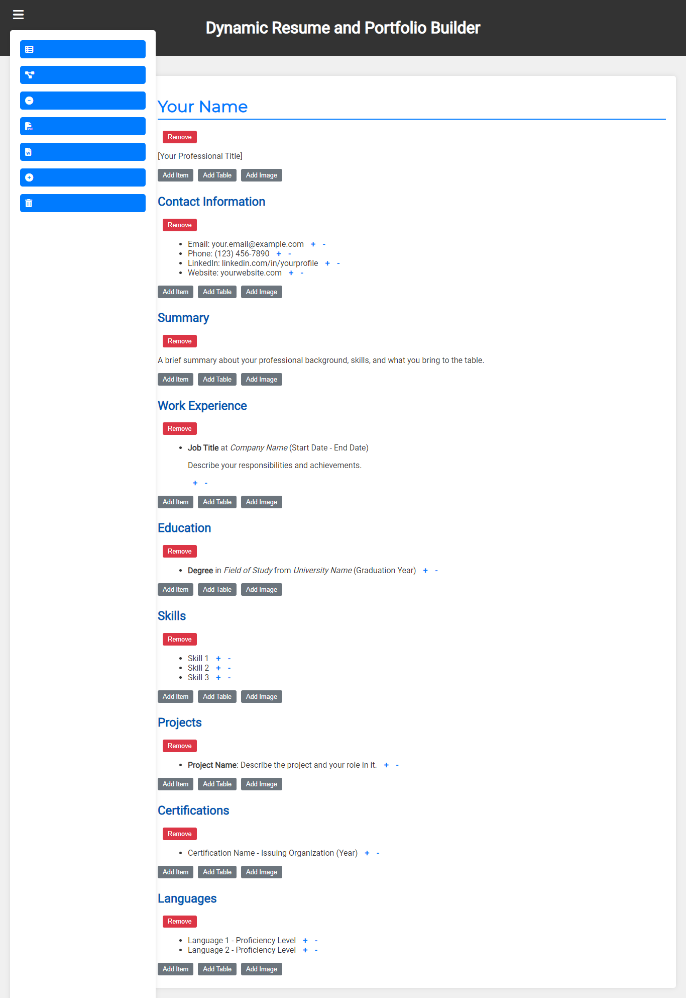

```markdown
# Resume Builder

[](LICENSE)
[](https://github.com/yasinULLAH/resume-builder/issues)
[](https://github.com/yasinULLAH/resume-builder/network)
[](https://github.com/yasinULLAH/resume-builder/stargazers)

A **Dynamic Resume Builder** that empowers users to create, customize, and export professional resumes effortlessly. With an intuitive interface and versatile features, build a resume that stands out.

## Features

- **Dynamic Editing:** Directly edit resume sections on the webpage.
- **Multiple Layouts:** Choose between Classic, Modern, and Minimalist designs.
- **Export Options:** Download your resume as PDF or DOCX.
- **Local Storage:** Automatically save your progress for seamless editing.
- **Responsive Design:** Access and edit your resume on any device.
- **Interactive Elements:** Add or remove sections, list items, tables, and images with ease.
- **Clean Export:** Ensure exported documents are free from interactive buttons and controls.

## Screenshot



## Technologies Used

- **HTML5** - Structure of the application.
- **CSS3** - Styling and responsive design.
- **JavaScript** - Interactive functionality.
- **html2pdf.js** - Exporting resume to PDF.
- **Font Awesome** - Icons for UI elements.
- **Google Fonts** - Custom fonts for enhanced aesthetics.

## Installation

1. **Clone the Repository:**

   ```bash
   git clone https://github.com/yasinULLAH/resume-builder.git
   ```

2. **Navigate to the Project Directory:**

   ```bash
   cd resume-builder
   ```

3. **Open the Application:**

   - Open `index.html` in your preferred web browser.

   Alternatively, you can use a live server extension if you're using VS Code or any other code editor that supports live server functionality.

## Usage

1. **Toggle Sidebar:**
   - Click the hamburger icon (☰) in the top-left corner to open or close the sidebar containing action buttons.

2. **Edit Resume:**
   - Click on any text within the resume sections to edit it directly.
   - Use the "+" and "-" icons beside each list item to add or remove items dynamically.

3. **Change Layout:**
   - Use the sidebar buttons to switch between Classic, Modern, and Minimalist layouts.

4. **Add Sections and Elements:**
   - Click the "Add Section" button in the sidebar to insert a new section.
   - Within each section, use the action buttons to add list items, tables, or images as needed.

5. **Export Resume:**
   - Click on the "Export to PDF" or "Export to DOCX" buttons in the sidebar to download your resume in the desired format.
   - The exported PDF will exclude all interactive action buttons, providing a clean and professional document.

6. **Clear Data:**
   - Use the "Clear Data" button in the sidebar to remove all saved data from `localStorage` and reset the resume builder.

## Contributing

Contributions are welcome! If you'd like to enhance the Resume Builder, please follow these steps:

1. **Fork the Repository**

2. **Create a Feature Branch**

   ```bash
   git checkout -b feature/AmazingFeature
   ```

3. **Commit Your Changes**

   ```bash
   git commit -m 'Add some AmazingFeature'
   ```

4. **Push to the Branch**

   ```bash
   git push origin feature/AmazingFeature
   ```

5. **Open a Pull Request**

## License

This project is licensed under the [MIT License](LICENSE).

---

## Acknowledgements

- Inspired by the need for a customizable and user-friendly resume builder.
- Thanks to [html2pdf.js](https://github.com/eKoopmans/html2pdf.js) for enabling PDF exports.
- Icons provided by [Font Awesome](https://fontawesome.com/).
- Fonts provided by [Google Fonts](https://fonts.google.com/).
```
